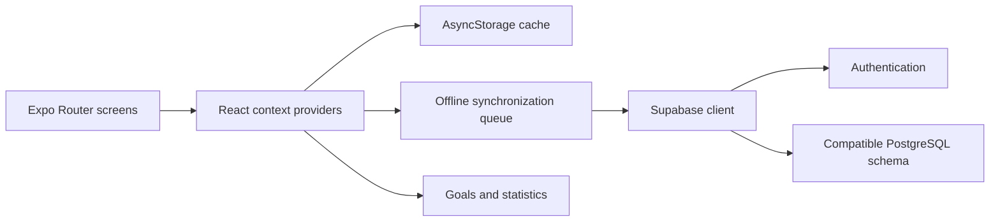

# Rizz - Activity Tracker

[](https://github.com/AbrarZShahriar/rizz-v4-ken/actions/workflows/ci.yml)

Rizz is an Expo and React Native prototype for recording daily activity and
progress across a sequence of milestones. It combines quick counters, goals,
history, and statistics for daily, weekly, monthly, and yearly periods.

> Project status: prototype. The current source targets Expo SDK 52 and React
> Native 0.76. It is not a published App Store or Play Store release.

## Features

- Email sign-up and sign-in through Supabase Authentication.
- Daily counters with goal progress and historical statistics.
- Offline caching and a queued synchronization path with AsyncStorage.
- Profile, theme, and goal settings.
- English and Japanese interface text.
- Android, iOS, and web development targets through Expo.

## Tech stack

- Expo SDK 52, React Native 0.76, React 18, and TypeScript.
- Expo Router and React Native Paper.
- Supabase for authentication and PostgreSQL data.
- Context providers for records, goals, profiles, and settings.
- Formik and Yup for forms and validation.

## Architecture



The context layer gives screens one consistent interface while local storage
keeps recent data available offline. Queued changes synchronize through the
Supabase client when network access returns.

## Run locally

Install Node.js 18 or later, npm, and one of the following:

- Expo Go on a physical device.
- Android Studio with an Android emulator.
- Xcode with an iOS simulator on macOS.

Then run:

```bash
git clone https://github.com/AbrarZShahriar/rizz-v4-ken.git
cd rizz-v4-ken
npm ci
cp .env.example .env
npm start
```

On PowerShell, use `Copy-Item .env.example .env` instead of `cp`.

Use the terminal shortcuts shown by Expo, or start a target directly:

```bash
npm run android
npm run ios
npm run web
```

## Supabase configuration

The original development backend is no longer available. Create a Supabase
project, copy `.env.example` to `.env`, and set both values:

```dotenv
EXPO_PUBLIC_SUPABASE_URL=https://your-project.supabase.co
EXPO_PUBLIC_SUPABASE_PUBLISHABLE_KEY=your-publishable-key
```

The application code uses the `profiles`, `daily_records`, `goals`, and
`daily_goals` tables. Database migrations are not included in this repository.
Create a compatible schema and Row Level Security policies before you point the
app at a new project. Values with the `EXPO_PUBLIC_` prefix are included in the
client application; they are not secrets. Protect every exposed table with
tested Row Level Security policies and never use a Supabase secret or
`service_role` key here.

Without that schema, the interface can start but account and synchronization
features will not work. Historical design notes under `docs/` are useful
context, not a complete or verified database migration.

## Development commands

```bash
npm start       # Start the Expo development server
npm run doctor  # Check Expo configuration and package compatibility
npm run lint    # Run Expo ESLint
npm run typecheck
npm test        # Run Jest in watch mode
npm run test:ci # Run Jest once, as CI does
```

The repository runs these checks on GitHub Actions. The current baseline passes
Expo Doctor, ESLint without warnings, TypeScript, and Jest. The Expo SDK 52
dependency tree still retains advisories that require a later SDK migration; do
not treat this snapshot as production-ready.

## Data and security

Rizz communicates only with the Supabase project you configure. Authentication,
profile, goal, and activity data go to that project; recent application data and
queued changes are also cached on the device with AsyncStorage. The repository
does not include analytics or telemetry integration.

See [SECURITY.md](SECURITY.md) for the reporting path and deployment boundary.

## Repository layout

```text
app/          Expo Router screens and layouts
components/   Reusable interface components
contexts/     Application state and synchronization
services/     Supabase data access
src/          Types and additional services
locales/      English and Japanese translations
docs/         Product notes, issue notes, and development logs
```
