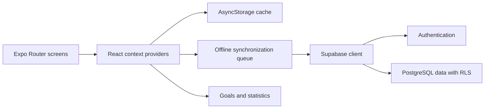

# Rizz - Activity Tracker

Rizz is an Expo and React Native prototype for recording daily activity and
progress across a sequence of milestones. It combines quick counters, goals,
history, and statistics for daily, weekly, monthly, and yearly periods.

> Project status: prototype. The current source targets Expo SDK 52 and React
> Native 0.76. It is not a published App Store or Play Store release.

## Features

- Email sign-up and sign-in through Supabase Authentication.
- Daily counters with goal progress and historical statistics.
- Offline caching and a queued synchronization path with AsyncStorage.
- Profile, theme, and goal settings.
- English and Japanese interface text.
- Android, iOS, and web development targets through Expo.

## Tech stack

- Expo SDK 52, React Native 0.76, React 18, and TypeScript.
- Expo Router and React Native Paper.
- Supabase for authentication and PostgreSQL data.
- Context providers for records, goals, profiles, and settings.
- Formik and Yup for forms and validation.

## Architecture



The context layer gives screens one consistent interface while local storage
keeps recent data available offline. Queued changes synchronize through the
Supabase client when network access returns.

## Run locally

Install Node.js 18 or later, npm, and one of the following:

- Expo Go on a physical device.
- Android Studio with an Android emulator.
- Xcode with an iOS simulator on macOS.

Then run:

```bash
git clone https://github.com/AbrarZShahriar/rizz-v4-ken.git
cd rizz-v4-ken
npm ci
npm start
```

Use the terminal shortcuts shown by Expo, or start a target directly:

```bash
npm run android
npm run ios
npm run web
```

## Supabase configuration

The committed Expo configuration uses the original development Supabase
project. To use another Supabase project, create `.env` in the repository root:

```dotenv
EXPO_PUBLIC_SUPABASE_URL=https://your-project.supabase.co
EXPO_PUBLIC_SUPABASE_ANON_KEY=your-anon-key
```

The application code uses the `profiles`, `daily_records`, `goals`, and
`daily_goals` tables. Database migrations are not included in this repository.
Create a compatible schema and Row Level Security policies before you point the
app at a new project. Values with the `EXPO_PUBLIC_` prefix are included in the
client application, so database access must be protected by those policies.

## Development commands

```bash
npm start       # Start the Expo development server
npm run lint    # Configure and run Expo ESLint
npm test        # Run Jest in watch mode
```

`npm ci` succeeds on the current snapshot. The first lint run creates an Expo
ESLint configuration, but the existing application then reports lint errors.
`npx tsc --noEmit` also reports existing type and unresolved-module errors.
The Jest snapshot suite needs an AsyncStorage mock before it can run. The
dependency audit also reports known vulnerabilities. Treat these results as a
list of prototype cleanup work, not as a passing or production-ready baseline.

## Repository layout

```text
app/          Expo Router screens and layouts
components/   Reusable interface components
contexts/     Application state and synchronization
services/     Supabase data access
src/          Types and additional services
locales/      English and Japanese translations
docs/         Product notes, issue notes, and development logs
```
